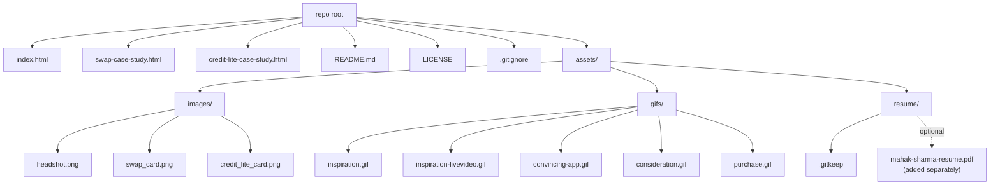

# Design Document

## Overview

This is a single-pass restructure of the repository root into a clean static-site layout. There is no application logic, no build step, no framework, no runtime. The "system" is three HTML files plus an `assets/` tree, served by opening `index.html` from the local filesystem (or a static host).

The work decomposes into four classes of operation:

1. **Filesystem moves** — relocate eight binary assets into `assets/images/` and `assets/gifs/`, create an empty `assets/resume/` directory.
2. **Filesystem renames** — `mahak-sharma-portfolio.html` → `index.html`; `credit-lite-portfolio-theme.html` → `credit-lite-case-study.html`.
3. **In-page edits** — update `href` and `src` attributes inside the three HTML pages so that every local reference resolves under the new layout, and correct the resume filename from `mahak-chanana-resume.pdf` to `mahak-sharma-resume.pdf`.
4. **Repo hygiene** — add `README.md`, delete `.wiki.md`, confirm `.gitignore` already covers `.DS_Store`, add a `.gitkeep` to `assets/resume/` so the empty directory survives commits.

The directories `app/`, `uploads/`, and `.atoms/` are out of scope and untouched.

The design is deliberately exhaustive on the in-page edit table so the work can be performed mechanically without re-reading the source HTML.

## Architecture

### Final filesystem layout

```text
.
├── .gitignore              (existing — confirmed to cover .DS_Store)
├── LICENSE                 (existing — unchanged)
├── README.md               (new)
├── index.html              (renamed from mahak-sharma-portfolio.html, edited)
├── swap-case-study.html    (existing path — edited)
├── credit-lite-case-study.html
│                           (renamed from credit-lite-portfolio-theme.html, edited)
├── assets/
│   ├── images/
│   │   ├── headshot.png
│   │   ├── swap_card.png
│   │   └── credit_lite_card.png
│   ├── gifs/
│   │   ├── inspiration.gif
│   │   ├── inspiration-livevideo.gif
│   │   ├── convincing-app.gif
│   │   ├── consideration.gif
│   │   └── purchase.gif
│   └── resume/
│       └── .gitkeep        (placeholder; mahak-sharma-resume.pdf added separately)
│
├── app/                    (out of scope — byte-identical)
├── uploads/                (out of scope — byte-identical)
└── .atoms/                 (out of scope — byte-identical)
```

### Layout diagram



### Out-of-scope boundary

`app/`, `uploads/`, and `.atoms/` are excluded by the Restructure_Process. No file inside them is read, moved, deleted, or modified, and no new file is added to them. This is enforced by the verification step in Testing Strategy via `git status --porcelain` filtered against those paths.

## Components and Interfaces

There is no runtime "component" model here. The artefacts are static files. For each artefact the design specifies its post-restructure path and its responsibility.

### Pages

| Page | Path (post) | Role |
| --- | --- | --- |
| Portfolio_Page | `index.html` | Landing page; links out to two case studies and to the resume PDF; renders headshot and two project card images. |
| Swap_Case_Study_Page | `swap-case-study.html` | Case study; renders five GIFs; links back to `index.html`. |
| Credit_Lite_Case_Study_Page | `credit-lite-case-study.html` | Case study; links back to `index.html`. (No images of its own — only the card image referenced from `index.html`.) |

### Assets

| Asset | Path (post) | Referenced by |
| --- | --- | --- |
| `headshot.png` | `assets/images/headshot.png` | `index.html` |
| `swap_card.png` | `assets/images/swap_card.png` | `index.html` |
| `credit_lite_card.png` | `assets/images/credit_lite_card.png` | `index.html` |
| `inspiration.gif` | `assets/gifs/inspiration.gif` | `swap-case-study.html` |
| `inspiration-livevideo.gif` | `assets/gifs/inspiration-livevideo.gif` | `swap-case-study.html` |
| `convincing-app.gif` | `assets/gifs/convincing-app.gif` | `swap-case-study.html` |
| `consideration.gif` | `assets/gifs/consideration.gif` | `swap-case-study.html` |
| `purchase.gif` | `assets/gifs/purchase.gif` | `swap-case-study.html` |
| `mahak-sharma-resume.pdf` | `assets/resume/mahak-sharma-resume.pdf` | `index.html` (intentionally absent at restructure time) |

### Repo files

| File | Path | Role |
| --- | --- | --- |
| README | `README.md` | Orient first-time visitors; document layout and viewing instructions. |
| Git ignore | `.gitignore` | Already contains `.DS_Store` pattern; no edits required. |
| License | `LICENSE` | Unchanged. |
| Resume placeholder | `assets/resume/.gitkeep` | Empty file so the directory survives commits before the PDF lands. |

## Data Models

### File-move table (source → destination)

Performed via `git mv` so history is preserved.

| # | Source path (pre) | Destination path (post) | Operation |
| --- | --- | --- | --- |
| 1 | `mahak-sharma-portfolio.html` | `index.html` | rename |
| 2 | `credit-lite-portfolio-theme.html` | `credit-lite-case-study.html` | rename |
| 3 | `headshot.png` | `assets/images/headshot.png` | move |
| 4 | `swap_card.png` | `assets/images/swap_card.png` | move |
| 5 | `credit_lite_card.png` | `assets/images/credit_lite_card.png` | move |
| 6 | `inspiration.gif` | `assets/gifs/inspiration.gif` | move |
| 7 | `inspiration-livevideo.gif` | `assets/gifs/inspiration-livevideo.gif` | move |
| 8 | `convincing-app.gif` | `assets/gifs/convincing-app.gif` | move |
| 9 | `consideration.gif` | `assets/gifs/consideration.gif` | move |
| 10 | `purchase.gif` | `assets/gifs/purchase.gif` | move |
| 11 | (none) | `assets/resume/.gitkeep` | create empty file |
| 12 | `.wiki.md` | (deleted) | delete |
| 13 | `swap-case-study.html` | `swap-case-study.html` | edited in place (no rename) |

`swap-case-study.html` keeps its filename; only its contents change.

### In-page edits — exhaustive substring replacement table

All replacements are literal-string find/replace. Each row is unambiguous: the `oldStr` appears exactly N times in the named file (N stated), and each occurrence is replaced with the same `newStr`. No regex needed. After applying all rows, every `href` and `src` referencing a local file resolves under the new layout, and the resume filename is corrected.

#### Edits in `mahak-sharma-portfolio.html` (which becomes `index.html`)

| # | Occurrences | Old substring | New substring | Reason |
| --- | --- | --- | --- | --- |
| P1 | 2 | `./mahak-chanana-resume.pdf` | `./assets/resume/mahak-sharma-resume.pdf` | Correct surname + relocate under `assets/resume/`. (Hits both the hero "Download resume" button and the contact-section `/Resume` link.) |
| P2 | 1 | `src="./headshot.png"` | `src="./assets/images/headshot.png"` | Headshot moved. |
| P3 | 1 | `src="./swap_card.png"` | `src="./assets/images/swap_card.png"` | Project card image moved. |
| P4 | 1 | `src="./credit_lite_card.png"` | `src="./assets/images/credit_lite_card.png"` | Project card image moved. |
| P5 | 1 | `href="./credit-lite-portfolio-theme.html"` | `href="./credit-lite-case-study.html"` | Credit Lite page renamed. |

The SWAP card link `href="./swap-case-study.html"` is already correct and is not edited.

The `download` attribute on both resume anchors is preserved because the substring replacement only touches the path inside `href`, not the `download` attribute.

#### Edits in `swap-case-study.html`

| # | Occurrences | Old substring | New substring | Reason |
| --- | --- | --- | --- | --- |
| S1 | 2 | `href="./mahak-sharma-portfolio.html"` | `href="./index.html"` | Wordmark + "Back to portfolio" link in the nav. |
| S2 | 1 | `href="./mahak-sharma-portfolio.html#projects"` | `href="./index.html#projects"` | Footer "Back to Projects" link. |
| S3 | 1 | `src="inspiration-livevideo.gif"` | `src="./assets/gifs/inspiration-livevideo.gif"` | GIF moved; also normalises to `./` prefix. |
| S4 | 1 | `src="inspiration.gif"` | `src="./assets/gifs/inspiration.gif"` | GIF moved. |
| S5 | 1 | `src="convincing-app.gif"` | `src="./assets/gifs/convincing-app.gif"` | GIF moved. |
| S6 | 1 | `src="consideration.gif"` | `src="./assets/gifs/consideration.gif"` | GIF moved. |
| S7 | 1 | `src="purchase.gif"` | `src="./assets/gifs/purchase.gif"` | GIF moved. |

> **Edit ordering note for S1 / S2.** Because `S1` is a strict prefix of `S2`, the replacements must be applied with S2 first (longer match) **or** in a single pass that uses the full attribute value as the match key. The table above is written so that each `oldStr` is the full attribute up through the closing quote (or, for S2, up through the fragment), making the two non-overlapping when applied as literal substring replacements in either order. Verified by inspection: there are exactly 2 occurrences of `href="./mahak-sharma-portfolio.html"` (the wordmark and "Back to portfolio") and exactly 1 occurrence of `href="./mahak-sharma-portfolio.html#projects"` (the footer "Back to Projects"); the fragment occurrence does not match S1's pattern because its closing quote is preceded by `#projects`.

#### Edits in `credit-lite-portfolio-theme.html` (which becomes `credit-lite-case-study.html`)

| # | Occurrences | Old substring | New substring | Reason |
| --- | --- | --- | --- | --- |
| C1 | 2 | `href="./mahak-sharma-portfolio.html"` | `href="./index.html"` | Wordmark + "Back to portfolio" link in the nav. |
| C2 | 1 | `href="./mahak-sharma-portfolio.html#projects"` | `href="./index.html#projects"` | Footer "Back to Projects" link. |

The same ordering note as in the SWAP edits applies: C2 must not be partially shadowed by C1. Because each `oldStr` is the full attribute including the closing quote, the two are non-overlapping.

This page has no image references in its body, so no image-path edits are required.

### README.md content outline

The README is short and oriented to a first-time reader. Section headings:

1. **Title** — `# Mahak Sharma — Portfolio` (H1).
2. **What this is** — one paragraph: this repo is the static portfolio site for Mahak Sharma, served as plain HTML.
3. **Layout** — fenced `text` block reproducing the post-restructure tree from Architecture above (root files + `assets/` subtree). Brief one-line annotation per top-level entry.
4. **Pages** — one bullet each for `index.html`, `swap-case-study.html`, `credit-lite-case-study.html`, naming what each contains.
5. **Assets** — short paragraph: images live in `assets/images/`, animated GIFs in `assets/gifs/`, the resume PDF belongs at `assets/resume/mahak-sharma-resume.pdf` and is added separately from this restructure (the directory is committed empty via `.gitkeep`).
6. **Viewing locally** — two options, each one or two commands:
   - Direct file open: open `index.html` in a browser.
   - Static server: `python -m http.server 8000` from the repo root, then visit `http://localhost:8000/`.
7. **What is out of scope** — one paragraph: `app/`, `uploads/`, and `.atoms/` are unrelated to the public site and are not modified by the restructure.
8. **License** — one line pointing to `LICENSE`.

Total length target: under one screen. No images, no badges.

### .gitignore additions

The current `.gitignore` already contains the line:

```text
.DS_Store
```

A pattern with no leading slash matches at any depth in Git, so Requirement 11.1 is already satisfied. **No edits to `.gitignore` are required by this restructure.** The verification step still asserts the pattern is present, so a regression that removed it would be caught.

If the maintainer wants to be explicit, an equivalent and harmless addition would be `**/.DS_Store`, but this is optional and the design does not require it.

## Error Handling

Static-site reorg has no runtime error paths. The "errors" the design must handle are operational:

1. **Resume PDF intentionally absent.** The link `./assets/resume/mahak-sharma-resume.pdf` will resolve to a 404 (or local "file not found") until the PDF is dropped in. This is the single documented exception in Requirement 7.1. No other reference is allowed to dangle.
2. **`.DS_Store` files appearing during work.** Already ignored by `.gitignore`, so they cannot enter history accidentally.
3. **A move that leaves a stale copy at the old path.** Prevented by using `git mv` (which atomically removes the source) rather than `cp`. Verified by the "no leftover root assets" check in Testing Strategy.
4. **An edit that misses an occurrence.** Prevented by the exhaustive substring tables above, which state expected occurrence counts. Verified by `grep` for stale strings (`mahak-chanana-resume.pdf`, `mahak-sharma-portfolio.html`, `credit-lite-portfolio-theme.html`) returning zero matches across the repo (excluding the spec docs themselves).
5. **Collision on rename target.** `index.html` and `credit-lite-case-study.html` do not exist at the root before the restructure (verified — see file tree). No `git mv` will be blocked.
6. **Empty directory not committed.** Git does not track empty directories. Mitigated by adding `assets/resume/.gitkeep`.

## Testing Strategy

### Why property-based testing does not apply

This feature has no code under test. There is no function with inputs and outputs, no parser, no serializer, no transformation. The "logic" of the feature is exhausted by a fixed list of file moves, a fixed list of literal-string substitutions, and a fixed expected directory tree. There is no input space over which a "for all X, P(X)" statement would be meaningful: every relevant value is a specific, named file or a specific, named string.

Therefore the design omits the Correctness Properties section (per the workflow's PBT-not-appropriate branch) and replaces it with binary content/structure invariants that are verifiable by reading the files — listed below.

### Verification approach

Verification is a series of binary checks runnable from the repo root in Git Bash on Windows. Each check is one shell line that exits zero when the invariant holds and non-zero when it does not. They map 1:1 to the requirements' invariants. Run all of them after performing the moves and edits; the restructure is complete only when every check passes.

#### V1. Required files and directories exist (Requirements 1.1–1.6, 2.1–2.4, 2.7, 10.1)

```bash
test -f index.html
test -f swap-case-study.html
test -f credit-lite-case-study.html
test -f LICENSE
test -f README.md
test -f .gitignore
test -d assets/images
test -d assets/gifs
test -d assets/resume
test -f assets/resume/.gitkeep
```

#### V2. Required asset files are at their new paths (Requirements 2.5, 2.6)

```bash
test -f assets/images/headshot.png
test -f assets/images/swap_card.png
test -f assets/images/credit_lite_card.png
test -f assets/gifs/inspiration.gif
test -f assets/gifs/inspiration-livevideo.gif
test -f assets/gifs/convincing-app.gif
test -f assets/gifs/consideration.gif
test -f assets/gifs/purchase.gif
```

#### V3. Old root-level files are gone (Requirements 1.7, 13.1)

```bash
for f in mahak-sharma-portfolio.html credit-lite-portfolio-theme.html \
         headshot.png swap_card.png credit_lite_card.png \
         inspiration.gif inspiration-livevideo.gif convincing-app.gif \
         consideration.gif purchase.gif .wiki.md; do
  test ! -e "$f" || { echo "stale: $f"; exit 1; }
done
```

#### V4. No stale page references anywhere in the served pages (Requirements 3.3, 4.6)

```bash
# Should each return zero matches across the three pages.
! grep -nF 'mahak-chanana-resume.pdf'        index.html swap-case-study.html credit-lite-case-study.html
! grep -nF 'mahak-sharma-portfolio.html'     index.html swap-case-study.html credit-lite-case-study.html
! grep -nF 'credit-lite-portfolio-theme.html' index.html swap-case-study.html credit-lite-case-study.html
```

#### V5. Required new references are present in the served pages (Requirements 3.1, 4.1–4.5, 5.1–5.6, 6.1)

```bash
# index.html must reference each new path at least once.
grep -qF './assets/resume/mahak-sharma-resume.pdf' index.html
grep -qF './assets/images/headshot.png'            index.html
grep -qF './assets/images/swap_card.png'           index.html
grep -qF './assets/images/credit_lite_card.png'    index.html
grep -qF './swap-case-study.html'                  index.html
grep -qF './credit-lite-case-study.html'           index.html

# swap-case-study.html must reference each gif and the home page.
grep -qF './assets/gifs/inspiration.gif'           swap-case-study.html
grep -qF './assets/gifs/inspiration-livevideo.gif' swap-case-study.html
grep -qF './assets/gifs/convincing-app.gif'        swap-case-study.html
grep -qF './assets/gifs/consideration.gif'         swap-case-study.html
grep -qF './assets/gifs/purchase.gif'              swap-case-study.html
grep -qF './index.html'                            swap-case-study.html

# credit-lite-case-study.html must link back to home.
grep -qF './index.html' credit-lite-case-study.html
```

#### V6. Resume `download` attribute preserved (Requirement 3.2)

```bash
# Every resume anchor must carry the download attribute.
# Expected: 2 matches in index.html (hero CTA + contact link), 0 elsewhere.
grep -cE 'href="\./assets/resume/mahak-sharma-resume\.pdf" download' index.html
# Should print 2
```

#### V7. `.gitignore` covers `.DS_Store` (Requirement 11.1)

```bash
grep -qE '(^|/)\.DS_Store($|/)' .gitignore || grep -qE '^\.DS_Store$' .gitignore
```

#### V8. Out-of-scope directories are byte-identical (Requirements 12.1–12.4)

Run before any work:

```bash
git ls-tree -r HEAD -- app uploads .atoms | sort > /tmp/oos-before.txt
```

Run after all edits and moves but before commit:

```bash
git ls-files -- app uploads .atoms | sort > /tmp/oos-after.txt
diff /tmp/oos-before.txt <(git ls-tree -r HEAD -- app uploads .atoms | sort)
# Diff should be empty: no tracked files added, removed, or modified.
git status --porcelain -- app uploads .atoms
# Output should be empty.
```

#### V9. Local references resolve to existing files (Requirement 7.1)

For each `href`/`src` in the three pages whose value begins with `./` and ends with a known local extension, assert the file exists. The single allowed exception is `./assets/resume/mahak-sharma-resume.pdf`.

```bash
# Extract local-relative refs and check each exists.
# Expected output: only ./assets/resume/mahak-sharma-resume.pdf is missing.
grep -hoE '(href|src)="\./[^"]+\.(png|gif|pdf|html)"' \
  index.html swap-case-study.html credit-lite-case-study.html \
  | sed -E 's/.*"\.\/([^"]+)"/\1/' | sort -u | while read -r p; do
    if [ ! -f "$p" ] && [ "$p" != "assets/resume/mahak-sharma-resume.pdf" ]; then
      echo "broken: $p"; exit 1
    fi
  done
```

V9 is the strongest check: it directly enforces Requirement 7.1's invariant that every local reference resolves, with the documented single exception.

### Manual smoke check

After V1–V9 pass, open `index.html` in a browser via the local filesystem and visually confirm:

- Headshot, SWAP card, and Credit Lite card all render (Requirement 7.2).
- Clicking the SWAP card opens `swap-case-study.html`, where all five GIFs render (Requirement 7.3, 8.1).
- Clicking the Credit Lite card opens `credit-lite-case-study.html` (Requirement 8.2).
- From either case study, the wordmark and "Back to portfolio"/"Back to Projects" links return to `index.html` (Requirements 8.3, 8.4).
- The "Download resume" button on `index.html` triggers a download attempt for `mahak-sharma-resume.pdf` (and 404s if the PDF is not yet present — expected per Requirement 7.4).

This manual step is the only one that exercises browser rendering. Everything else is automated by V1–V9.

## Risks and how the design handles them

### R1. Out-of-scope directories accidentally modified

`app/`, `uploads/`, `.atoms/` contain unrelated work. A careless `git mv` glob or a recursive find/replace could perturb them.

**Mitigation.** Every move and edit is enumerated by exact path in the tables above; no glob crosses an out-of-scope boundary. The verification step V8 captures a `git ls-tree` snapshot before work and diffs it after, plus runs `git status --porcelain` filtered to those three paths. Any drift fails the restructure.

### R2. Visual regressions from broader-than-intended edits

Requirement 9 requires that the three pages differ from their pre-restructure form **only** in `href`/`src` attribute values. A find-replace that bleeds into `<style>` blocks, copy text, or DOM structure violates this.

**Mitigation.** The substring replacement tables target only quoted attribute values (each `oldStr` includes the surrounding `="..."` for the SWAP and Credit Lite back-link rows, and the resume edit replaces a path that does not appear elsewhere). Verification: `git diff --shortstat` on the renamed files plus a structural sanity check — `grep -c '<style>'` and `grep -c '</style>'` should match pre and post values, and the count of `<section>`, `<h1>`, `<h2>` tags should be unchanged. (These three counts are sufficient as a cheap structural fingerprint; a full byte-level guarantee would require comparing post-edit content with pre-edit content with only the listed substitutions applied.)

### R3. Missing resume PDF

The PDF is intentionally not produced by this work. The link will dangle until the file is dropped in.

**Mitigation.** Documented as the single exception in V9 and in the README. The button still works (issues a download request); only the response is a 404. No other anchor on the page is affected (Requirement 7.4). The directory `assets/resume/` exists from day one (with `.gitkeep`) so the eventual drop-in is a single file copy with no further structural change.

### R4. Case-sensitive rename hazard on case-insensitive filesystems

The user's environment is Windows + bash. Windows NTFS and macOS HFS+/APFS default-config are case-insensitive but case-preserving; Git on these filesystems can produce confusing rename results when the target name differs from the source only in case.

**Assessment.** Neither rename in this restructure is a case-only rename:

- `mahak-sharma-portfolio.html` → `index.html` — entirely different name.
- `credit-lite-portfolio-theme.html` → `credit-lite-case-study.html` — different name (different middle segment).

Therefore plain `git mv old new` works correctly on case-insensitive and case-sensitive filesystems alike, with no two-step rename dance required.

**Mitigation.** Use `git mv` (not `mv` followed by `git add/rm`) so the rename is recorded as a rename, history follows, and the working tree reflects the new name immediately. After both renames, `git status` should show `renamed:` lines, not paired `deleted:`/`new file:` lines. If it does show paired lines, the work was done with `mv` instead of `git mv` and should be redone.

### R5. Edit ordering when one substring is a prefix of another

In `swap-case-study.html` and `credit-lite-case-study.html` the substring `href="./mahak-sharma-portfolio.html"` is a strict prefix of `href="./mahak-sharma-portfolio.html#projects"`. Naïve sequential replacement that processed the prefix first would either over-match or leave the suffix dangling.

**Mitigation.** Each `oldStr` in the edit table includes the closing `"` (or, for the fragment row, the `#projects"` tail). This makes the two strings non-overlapping under literal substring replacement, regardless of order. Verification V4 catches any leftover `mahak-sharma-portfolio.html` regardless of ordering.

### R6. `.gitignore` regression

A future change could drop the `.DS_Store` line.

**Mitigation.** V7 asserts the pattern is present. The check is independent of the rest of the verification suite, so a `.gitignore` regression alone fails the restructure.

